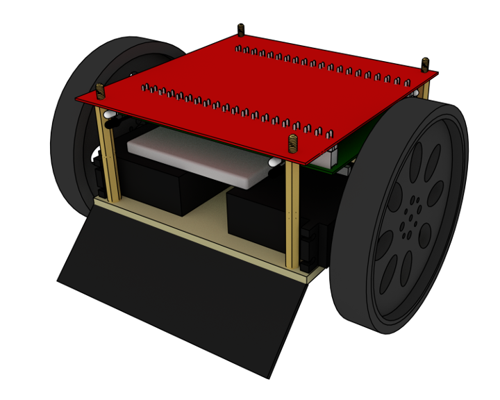

#SumoCHIP

SumoCHIP is an extremely low-budget robotics platform based on CHIP single-board
computer developed by [Robotics Club of Estonian IT College](http://robot.itcollege.ee).
SumoCHIP is designed for teaching soldering, electronics, programming
and networking. We kept SumoCHIP daughterboard PCB design single-sided so it
would be easy to etch at home or school.

##Documentation

Documentation will be available in various languages:

* [Estonian](doc/index-et/index-et.md)
* [English](doc/index-en/index-en.md)

##Kits

Being completely open hardware you can order the components and assemble the
robot yourself with the prices stated in the [bill of materials](doc/bom.md) page.
Robotics Club of Estonian IT College provides kits within EU which saves
you the hassle of purchasing invidual components online.

| Description                                                    | Price                         |
|----------------------------------------------------------------|-------------------------------|
| SumoCHIP PCB and solderable components only                    | 20 EUR + recommended donation |
| Everything except [C.H.I.P.](http://getchip.com/products/chip) | 40 EUR + recommended donation |
| All in one batteries included kit                              | 50 EUR + recommended donation |

When ordering please specify whether you want PCB to be soldered or not,
soldered board adds extra 10 EUR to the price. We can also ship custom
configurations of components.
Donations are used to renew the equipment of robotics club so we could continue doing cool stuff!

To order send us e-mail and we'll reply with an invoice PDF.
Within EU standard [SEPA](https://en.wikipedia.org/wiki/Single_Euro_Payments_Area)
payments are expected. Once payment is received the kits will be shipped with
standard mail services once a week.

##Software

The current implementation is based on Python and Flask.
In future we might add kernel module for generating fine grained PWM signals
to achieve better timing granularity for servo motors.
