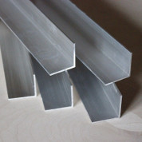
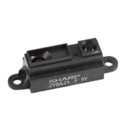

# Bill of materials

To save money and to get best out of the learning process you can order components online and have students assemble the robot. The prices below are according to NextThingCo and AliExpress listings and include shipping to EU. While importing to EU taxes may apply. Prices assume at least 10 robots are going to be assembled.

| Image                                 | Description                                                                                                                                                                         | Amount               | Row total |
|---------------------------------------|-------------------------------------------------------------------------------------------------------------------------------------------------------------------------------------|----------------------|-----------|
|                  | [C.H.I.P.](http://getchip.com/products/chip) from NextThingCo                                                                                                                       | 10pcs                | 94.32 EUR |
|               | Plastic geared continuous servo motor [FS90R](http://www.aliexpress.com/item/5-pcs-9g-Mini-360-Degree-Continuous-Rotation-Robot-Servo-FS90R/32621562033.html)                       | 20pcs (4 lots of 5)  | 63.63 EUR |
|  | [Spoked wheel](http://www.aliexpress.com/item/10-pcs-wheel-for-9g-360-Degree-Continuous-Rotation-Micro-Robot-Servo-FS90R/32609379555.html)                                          | 20pcs (2 lots of 10) | 34.70 EUR |
|                  | Lithium Polymer batteries [3.7V 1100mAh](http://www.aliexpress.com/item/20pcs-lot-Free-Shipping-HRB-Lipo-Battery-3-7V-1100mah-15C-Max-30C-1S-Li-po/32430505576.html)                | 10pcs+               | 51.46 EUR |
|               | SumoCHIP daughterboard from [MakerStudio](http://makerstudio.cc/)                                                                                                                   | 10pcs                |  15.2 EUR |
|        | L-profile aluminium sheet                                                                                                                                                           | 60x60x60mm           |   5.5 EUR |
|                  | [Infrared emitter and receiver](http://www.aliexpress.com/item/100PCS-5mm-940nm-LEDs-infrared-emitter-and-IR-receiver-diode-50pairs-diodes-301A/2001367152.html)                    | 50 pairs             |  4.01 EUR |
|  | Surface mounted [resistors](http://www.aliexpress.com/item/100-New-SMD-Resistance-500PCS-Lot-0805-Combination-set-620R-12K-5-25Kinds-Wholesale-Electronic-500PCS/32420120683.html)  | 200pcs               |  1.67 EUR |
| ...                                   | [40-pin 2.54mm header](http://www.aliexpress.com/item/Free-shipping-1Set-20PCS-40Pin-2-54mm-Single-Row-Straight-Male-Pin-Header-Connector-Strip-For/32552698181.html)               | 20pcs                |  2.82 EUR |
|            | Surface mounted [LED](http://www.aliexpress.com/item/5-colors-x20pcs-100pcs-SMD-0805-led-Super-Bright-Red-Green-Blue-Yellow-White-Water-Clear/32542417127.html)                     | 50pcs                |  1.01 EUR |
|              | 60V 200mA N-channel [MOSFET](http://www.aliexpress.com/item/12pcs-2N7000-MOSFET-N-CH-60V-200MA-TO-92-NEW-GOOD-QUALITY/32390351935.html)                                             | 10pcs                |  0.85 EUR |
|                                       |                                                                                                                                                                                     | Total cost:          |  275  EUR |
|                                       |                                                                                                                                                                                     | Single robot cost:   |  27.5 EUR |

##Alternative components

Optional upgrades:

| Image                    | Description                                                | Amount | Item price | Subtotal | Price difference |
|--------------------------|------------------------------------------------------------|--------|------------|----------|------------------|
|  | Metal geared continuous servo motor                        | 2pcs   |   4.86 EUR | 9.72 EUR |        +3.4 EUR  |
|   | [Solid servo wheel](http://bit.ly/1UIPs3U)                 | 2pcs   |   2.19 EUR | 4.38 EUR |        +0.94 EUR |
|   | [Sharp GP2Y0A21Y0F](http://bit.ly/25U6HVd) distance sensor | 2pcs   |   3.24 EUR | 6.48 EUR |        ...       |

PCB alternatives, shipping to EU included:

| Image                    | Description                                                | Amount | Item price | Subtotal | Price difference |
|--------------------------|------------------------------------------------------------|--------|------------|----------|------------------|
|  | SumoCHIP PCB from [DirtyPCB-s](http://dirtypcbs.com/)      | 1pcs   |   2.22 EUR | 2.22 EUR | ...              |

