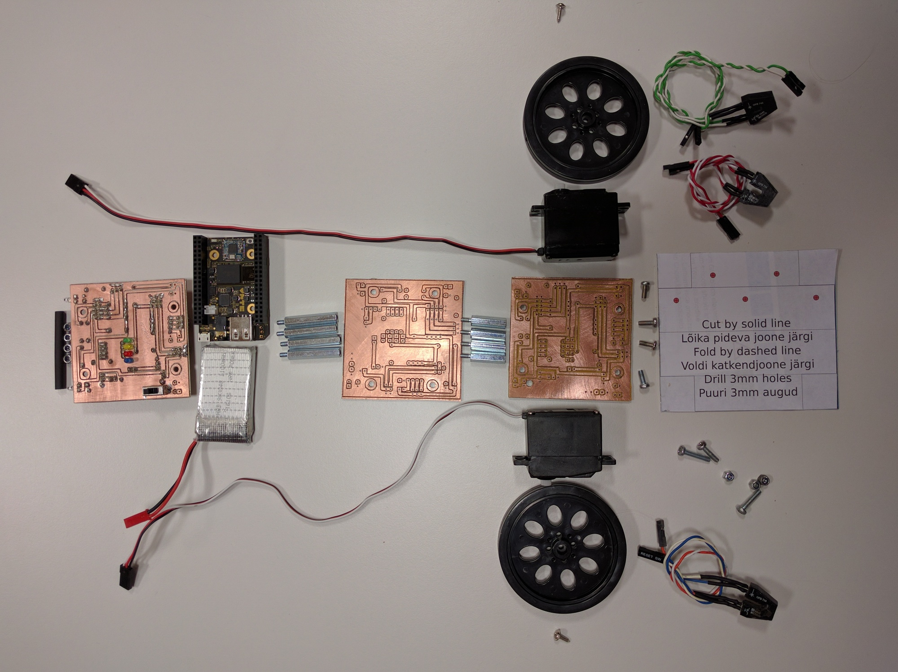

#SumoCHIP

##Sissejuhatus

Sumoroboti komplekti kuuluvad: SumoCHIP tütarplaat, CHIP emaplaat, liitiumpolümeeraku, 20mm ning 30mm distantskruvid, plaadid kere jaoks, kaks servomootorit, joonejälgimisandurid, mutrid, poldid, alumiiniumleht šablooniga saha jaoks ning termorüüž vastase andurite varjestamiseks.



Lisaks on vaja akutrelli, 3mm metallpuuri, plekikääre, kruvikeerajat, näpitsaid. Trükkplaadi jootmiseks on vaja ka jootekolbi, tina ning kampoli.

[TOC]

##Emaplaat

Sumorobotil kasutame ajuna CHIP nimelist arvutit mille hinnaks on umbkaudu 8€. CHIP emaplaadil on realiseeritud SoC (System on Chip) koos WiFi toega.


CHIP-il on päised LCD paneeliga ning CSI kaamera liidestamiseks. Kuna Allwinneri kiibistik võimaldab neid jalgu programmeerida üldotstarbeliste sisend/väljundviikudena ja roboti puhul LCD paneelile rakendust pole, saab samu väljaviike kasutada servomootorite juhtumiseks või sensoritest sisendi lugemiseks.


##Tütarplaat

###Tütarplaadi skeem

Sumoroboti jaoks on vaja teha liidestused mootorite ning sensoritega. SumoCHIP skeemis on loodud liidestused CHIP-i päiste ning infrapuna kaugussensorite, joonejälgimissensorite, servomoootorite ja diagnostiliste tuledega:


Skeemis on P abil märgistatud piikribad, D abil valgusdioodid, Q abil (foto)transistorid.

Roboti tööpõhimõte on üsna lihtne, robotil on kaheksa infrapunadioodi, mis lülitatakse võistlemise ajaks sisse, ning neist dioodidest tagasi peegelduvat valgust tuvastatakse kaheksa infrapuna fototransistoriga. Skeemis märgitud väljatransistor Q6 on kasutusel tütarplaadile joodetud D1, D6-D9 ning P13-P15 kaudu ühendatud infrapunadioodide sisse-välja lülitamiseks. Jõudeolekus on otstarbekas dioodid välja lülitada, muidu tarbivad nad asjata märgatava hulga voolu. Päise P7-8 jalgu tüüritakse vaikimisi läbi takistite 3.3V suunas, kuid tütarplaadile joodetud Q1-Q5 ning P10-P12 kaudu ühendatud fototransistorite avanedes peegeldunud või keskkkonna valguse tõttu tõmmatakse pinge 0V ligi. Tarkvaraliselt loogikaväärtusi kontrollides nendel jalgadel saab tuvastada, kas sensori ees on midagi (0V ehk *false*) või ei ole midagi (3.3V ehk *true*). Tütarplaadile joodetud sensorid on kasutusel vastase tuvastamiseks ning läbi P10-12 ja P13-15 kaudu on ühendatud joonejälgimissensorid.

###Trükkplaadi hankimine

Juhtmetega liidestuse tegemine on kohmakas ning on oht teha vigu, mistõttu võib kogu plaat maha põleda. Seetõttu on soovitatud hankida trükkplaat, mis ülalnimetatud skeemi realiseerib.

SumoCHIP trükkplaadi hankimiseks on laias laastus neli varianti:

* Osta IT Kolledži robootikaklubist
* Freesida CNC abil
* Söövitada koduste vahenditega
* Tellida DirtyPCB-st

Kicadi projekti leiab Git lähtekoodivaramust, sellest saab eksportida LinuxCNC jaoks sobivas formaadis failid. Freesimine käib kolmes etapis: esmalt freesitakse V-tüüpi otsikuga alumine pool (back.ngc); seejärel puuritakse augud (drill.ngc); jargnevalt pööratakse trükkplaat ümber, kinnitatakse külgmistesse aukudesse ning lõpuks freesitakse trükkplaadi ülemine pool (front.ngc). Näide CNC masinaga trükkplaadi freesimisest:


###Komponentide jootmine

Komponentide jootmisel on abiks järgnev joonis:


Jootmise järjekord:

0. Jooda takistid
0. Jooda päised
0. Jooda väljatransistor
0. Jooda infrapuna valgusdioodid
0. Jooda infrapuna fototransistorid

###Plaadi testimine

Kontrolli testeriga, et omavahel lühises ei oleks:

* Maa ja 3.3V rajad
* Maa ja 5V rajad
* 3.3V ja 5V rajad


##Roboti kokku panemine

###Emaplaadi ja tütarplaadi ühendamine

Kuna tütarplaadi jootmisel võib nii mõndagi nihu minna peaks tütarplaati enne emaplaadi külge ühendamist hoolikalt kontrollima. CHIP-i toiteploki võib üsna kergesti maha põletada kui näiteks CHIP käivitada nii et 5V rada või 3.3V rada on lühises maaga.

###Mootorite kinnitamine

Kasuta kahepoolset teipi et fikseerida mootorid korpuse plaatide suhtes.

###Aku ühendamine

Aku ühendatakse tütarplaadi aku päise külge.

***
Aku ühendamisel peab olema erakordselt tähelepanelik kuna aku tagurpidi ühendamisel kahjustub CHIP-i toiteplokk!
***

##Tarkvara

Sumoroboti baastarkvara on kirjutatud Python programmeerimiskeeles kasutades Flask veebirakenduste raamistikku. Baastarkvara lähtekood on kättesaadav GitHubist aadressil https://github.com/laurivosandi/sumochip ning parandused ning täiendused on teretulnud.


###Tarkvara paigaldus

Sumorobotit saab veebi kaudu programmeerida aga selleks et seda üldse teha on vaja robotisse esmalt paigaldada veebirakendus. Piisab sellest, et järgnevad sammud üks kord läbi teha roboti peal.

Kuna CHIP-il pole videoväljundeid on kuvari ühendamine problemaatiline. Eelistatud on hoopiski üle USB kaabli jadaliidese kasutamine selleks, et robotile teha esmane seadistus. Windows puhul on vaja paigaldada ohjurtarkvara, et üldse USB kaablit kasutada saaks. Mac OS X ning Linux puhul seda teha vaja pole.

Jadaliidese kasutamiseks võivad Windowsi kasutajad pruukida [PuTTY](http://www.chiark.greenend.org.uk/~sgtatham/putty/download.html) nimelist programmi. Ubuntu ning teiste UNIX-ilaadsete operatsioonisüsteemide all võib kasutada `screen`, `picocom` vms programme. Jadaliides võimaldab ligipääsu CHIP-i sees käiva tarkvara käsureale nii nagu paljude teiste nutiseadmete puhul. CHIP kasutab operatsioonisüsteemina Debiani ning paljud Ubuntust tuttavad käsud toimivad seal täpselt samamoodi.

Esmalt ühenda CHIP WiFi kaudu Internetti, selleks saad kasutada NetworkManageri pseudograafilist kasutajaliidest:

```bash
nmtui
```

Interneti ühenduse olemasolus saad veenduda näiteks `ping` abil, vajuta Ctrl-C et katkestada:

```bash
ping neti.ee
```

Kuna CHIP-il pole akut ega kella mis aja üle arvestust peaks püüab CHIP peale võrguühenduse loomist kellaaega küsida Internetist aga mõnikord võib see ebaõnnestuda. Kellaaja kontrollimiseks saab kasutada järgnevat käsku, turvalised ühendused Internetti (nt GitHub) kipuvad ebaõnnestuma kui kell on vale:

```bash
date
```

Kui võrguühendus on olemas võime teha CHIP-i operatsioonisüsteemile tarkvarauuenduse:

```bash
apt update       # Uuenda pakettide nimekirju
apt full-upgrade   # Uuenda pakette
```

Paigalda sõltuvused ning Git versioonihaldustarkvara:

```bash
apt install python-pip python-dev git
```

Seejärel võime paigaldada sumoroboti tarkvara Git lähtekoodi varamust:

```bash
pip install git+https://github.com/laurivosandi/sumochip
```

Kui kõik on seni sujuvalt kulgenud võib välja uurida mis IP aadressil CHIP asub. Selleks saab kasutada käsku:

```bash
ifconfig
```

Proovi algatada SSH ühendus robotisse, Windowsis saab selleks kasutada PuTTY-t ning UNIX-iliste all:

```bash
ssh <ip-aadress>
```

Paigalda konfiguratsioonifail mis ütleb mis jalgade külge servomootorid ja sensorid ühendatud on:

```bash
mkdir -p /etc/sumorobot/
curl https://raw.githubusercontent.com/artizirk/sumochip/master/sumochip/config/sumochip_v1.1.ini > /etc/sumorobot/sumorobot.ini
```


Käivita testprogramm, katkestamiseks vajuta jällegi Ctrl-C:

```bash
sumochip_test
```

Proovi käivitada ka veebiliides:

```bash
sumochip_web
```


Kui on vaja robotit viisakalt kinni panna siis selle jaoks saab kasutada käsku:

```bash
shutdown -h now
```


##Terminaliga ringi käimine

###Enimkasutatavad käsud

CHIP-i peal kasutatavad käsud töötavad täpselt samamoodi Raspberry Pi ning Ubuntu peal:

* Praeguse kataloogi tuvastamine: `pwd`
* Failide ning kataloogide nimekirja kuvamine praeguses kataloogis: `ls -lah`
* Sisene kataloogi: `cd katalooginimi`
* Mine ülemisse kataloogi: `cd ..`
* Faili kustutamine: `rm failinimi`

###Failide redigeerimine terminalis

CHIP-il nagu paljudel teistel Linuxilistel on kohe kaasas tekstiredaktor `nano`, selleks et faili avada selle programmiga:

```bash
nano tee/failini.py
```
Kasuta klahvikombinatsiooni Ctrl-K et teksti paigutada lõikepuhvrisse ning Ctrl-U et neid uude valitud kohta kleepida. Ctrl-X abil saab salvestada faili ning programmist väljuda.

Pisut mugavam tekstiredaktor on Midnight Comamnder koosseisus, selle paigaldamiseks:

```Bash
apt install mc
```

Failide avamine käib samamoodi:

```bash
mcedit tee/failini.py
```
Menüüdes navigeerimine käib analoogselt graafiliste rakendustega, Alt-F avab peamenüü. Kiirklahvidest kõige olulisemad on F5 kopeerimiseks, F6 lõikamiseks ning F10 programmist väljumiseks.
