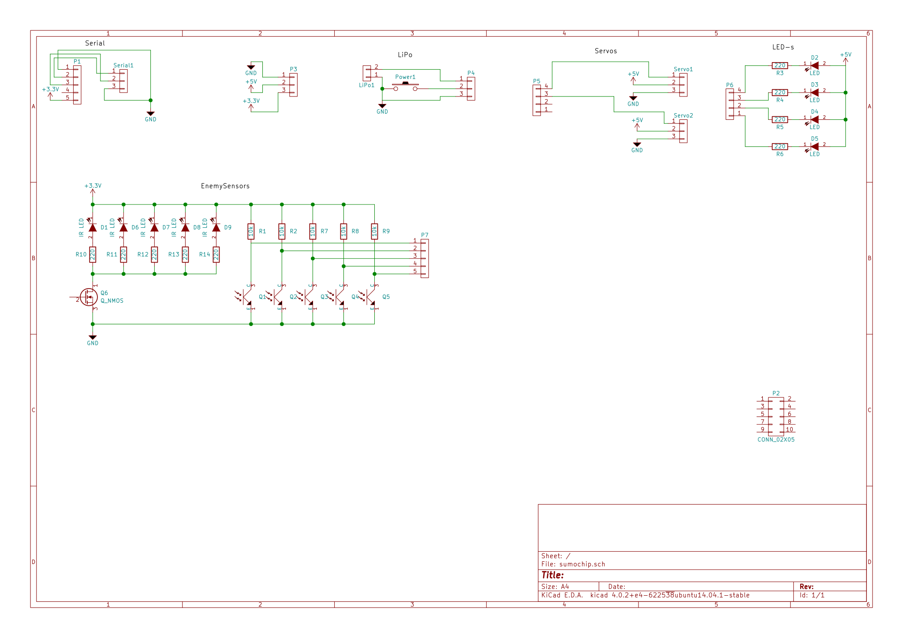
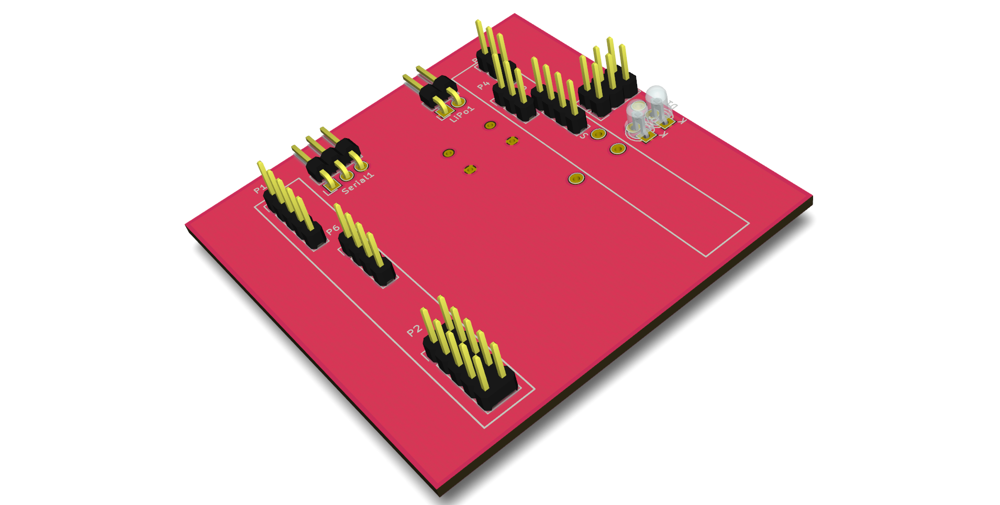

SumoCHIP
========


SumoCHIP tütarplaat
===================

Sissejuhatus
------------

CHIP emaplaadil on realiseeritud SoC koos WiFi toega. CHIP-il on päised LCD paneeliga ning CSI kaamera liidestamiseks. Kuna Allwinneri kiibistik võimaldab neid jalgu programmeerida üldotstarbeliste sisend/väljundviikudena ja roboti puhul LCD paneelile rakendust pole saab samu väljaviike kasutada servomootorite juhtumiseks või sensoritest sisendi lugemiseks.


Tütarplaadi skeem
-----------------

Sumoroboti jaoks on vaja teha liidestused mootorite ning sensoritega. SumoCHIP skeemis on loodud liidestused CHIP-i päiste ning infrapuna kaugussensorite, joonejälgimissensorite, servomoootorite ja indikaatortuledega:



Trükkplaadi hankimine
---------------------

Juhtmetega liidestuse tegemine on kohmakas ning on oht teha vigu mistõttu võib kogu plaat maha põleda. Seetõttu on soovitatud hankida trükkplaat mis ülalnimetatud skeemi realiseerib:




SumoCHIP trükkplaadi hankimiseks on laias laastus neli varianti:

* Osta IT Kolledži robootikaklubist
* Freesida CNC abil
* Söövitada koduste vahenditega
* Tellida DirtyPCB-st

LinuxCNC jaoks ette valmistatud .ngc failid leiab Git lähtekoodivaramust. Freesimine käib kolmes etapis: esmalt freesitakse V-tüüpi otsikuga alumine pool (back.ngc); seejärel puuritakse augud (drill.ngc); seejärel pööratakse trükkplaat ümber, kinnitatakse külgmistesse aukudesse ning lõpuks freesitakse trükkplaadi ülemine pool (front.ngc). Näide CNC masinaga trükkplaadi freesimisest:


Komponentide jootmine
---------------------

0. Jooda pindpaigaldatud takistid
0. Jooda pingpaigaldatud valgusdioodid
0. Jooda infrapuna valgusdioodid
0. Jooda infrapuna fototransistorid
0. Jooda väljatransistor
0. Jooda päised

Peale pindpaigaldatud komponentide jootmist:

  [Pilt siia]

Peale dioodide ning transistorite jootmist:

  [Pilt siia]

Valmis plaat:

  [Pilt siia]


Kontrolli testeriga, et omavahel lühises ei oleks:

* Maa ja 3.3V rajad
* Maa ja 5V rajad
* 3.3V ja 5V rajad
* Servo juhtjalad ja 5V
* Servo juhtjalad ja maa


Tarkvara paigaldus
------------------

Sumoroboti baastarkvara on kirjutatud Python programmeerimiskeeles kasutades Flask veebirakenduste raamistikku. Baastarkvara lähtekood on kättesaadav GitHubist aadressil https://github.com/laurivosandi/sumochip ning parandused ning täiendused on teretulnud.

Kuna CHIP-il pole videoväljundeid on kuvari ühendamine problemaatiline. Eelistatud on hoopiski USB-UART kaabli kasutamine selleks et robotile teha esmane seadistus. USB-UART silla kasutamiseks võivad Windowsi kasutajad pruukida [PuTTY](http://www.chiark.greenend.org.uk/~sgtatham/putty/download.html) nimelist programmi. Ubuntu ning teiste UNIX-ilaadsete operatsioonisüsteemide all võib kasutada `screen`, `picocom` vms programme.

USB-UART sild võimaldab ligipääsu CHIP-i sees käiva tarkvara käsureale nii nagu paljude teiste nutiseadmete puhul. CHIP kasutab operatsioonisüsteemina Debiani ning paljud Ubuntust tuttavad käsud toimivad seal täpselt samamoodi.

Esmalt ühenda CHIP-il WiFi kaudu Internetti, WiFi levialade otisimiseks:

```bash
nmcli device wifi list
```

Seejärel ühendu võrku:

```bash
nmcli device wifi connect 'võrgunimi' ifname wlan0
```

Juhul kui tegu on parooliga kaitstud võrguga:

```bash
nmcli device wifi connect 'võrgunimi' password 'parool' ifname wlan0
```

Interneti ühenduse olemasolus saad veenduda näiteks `ping` abil:

```bash
ping neti.ee
```

Kui võrguühendus on olemas võime teha CHIP-i operatsioonisüsteemile tarkvarauuenduse:

```bash
apt update       # Uuenda pakettide nimekirju
apt full-upgrade # Uuenda pakette
```

Seejärel võime alla laadida sumoroboti lähtekoodi varamu:

```bash
git clone http://github.com/laurivosandi/sumochip /root/sumochip/
```

Seejärel sisene kataloogi:

```bash
cd /root/sumochip
```

Paigalda sumoroboti baastarkvara:

```bash
python setup.py install
```


