## Komponendid

* [Alternatiivsed komponendid](#alternatiivsed-komponendid)
* [Emaplaat](#emaplaat)
* [Tütarplaat](#tütarplaat)
    * [Tütarplaadi skeem](#tütarplaadi-skeem)
    * [Trükkplaadi hankimine](#trükkplaadi-hankimine)
    * [Komponentide jootmine](#komponentide-jootmine)
    * [Plaadi testimine](#plaadi-testimine)

Järgnevalt on välja toodud 10 roboti ehitamise jaoks vajalikud komponendid ning umbkaudne kulu koos saatmisega Euroopa Liitu. Kauba sisenedes EU-sse võivad lisanduda veel importmaksud:

| Pilt                                  | Kirjeldus                              | Hulk     | Rida kokku |
|---------------------------------------|----------------------------------------|----------|------------|
| 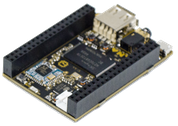                 | NextThingCo C.H.I.P.                   | 10tk     |  94.32 EUR |
|               | Plastik hammasratastega servo FS90R    | 20tk     |  63.63 EUR |
| 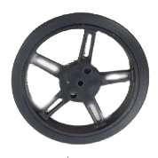 | Rattad                                 | 20tk     |  34.70 EUR |
| 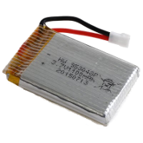                 | Liitiumpolümeeraku 3.7V 1100mAh        | 10tk+    |  51.46 EUR |
| 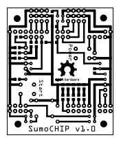              | SumoCHIP trükkplaat MakerStudiost      | 10tk     |  15.20 EUR |
| 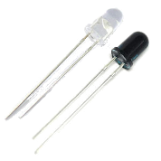                 | Infrared emitter and receiver          | 50 paari |   3.91 EUR |
| 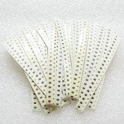 | 100 ohm resistors                      | 120tk    |   1.20 EUR |
|  | 10k ohm resistors                      | 30tk     |   0.60 EUR |
|  | 100k ohm resistors                     | 50tk     |   0.60 EUR |
| 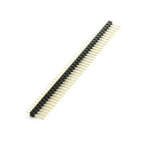      | 40-pin 2.54mm male straight header     | 13tk     |   1.02 EUR |
| 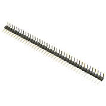        | 40-pin 2.54mm male angled header       | 1tk      |   0.44 EUR |
| 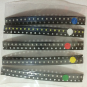           | LED-ide assortii                       | 50pcs    |   0.98 EUR |
| 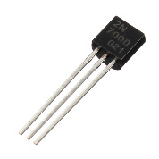             | 60V 200mA N-channel MOSFET             | 10pcs    |   0.85 EUR |
|                                       |                                        | Kokku:   | 270    EUR |
|                                       |                                        | Robot:   |  27    EUR |

Lingid hankimiseks:

- http://getchip.com/products/chip
- http://www.aliexpress.com/item/5-pcs-9g-Mini-360-Degree-Continuous-Rotation-Robot-Servo-FS90R/32621562033.html
- http://www.aliexpress.com/item/10-pcs-wheel-for-9g-360-Degree-Continuous-Rotation-Micro-Robot-Servo-FS90R/32609379555.html
- http://www.aliexpress.com/item/20pcs-lot-Free-Shipping-HRB-Lipo-Battery-3-7V-1100mah-15C-Max-30C-1S-Li-po/32430505576.html
- http://makerstudio.cc/
- http://www.aliexpress.com/item/100PCS-5mm-940nm-LEDs-infrared-emitter-and-IR-receiver-diode-50pairs-diodes-301A/2001367152.html
- http://www.aliexpress.com/item/100pcs-100-ohm-1-4W-100R-Metal-Film-Resistor-100ohm-0-25W-1-ROHS/32576340704.html
- http://www.aliexpress.com/item/100pcs-10k-ohm-1-4W-10k-Metal-Film-Resistor-10kohm-0-25W-1-ROHS/32577051768.html
- http://www.aliexpress.com/item/100pcs-100k-ohm-1-4W-100k-Metal-Film-Resistor-100kohm-0-25W-1-ROHS/32575205454.html
- http://www.aliexpress.com/item/Free-Shipping-40Pin-2-54mm-male-Single-Row-40P-single-Row-20pcs-40-pins-pin-header/1324468140.html
- http://www.aliexpress.com/item/2-Pcs-40-Position-2-54mm-Pitch-Single-Row-Right-Angle-Male-Pin-Header/32241048789.html
- http://www.aliexpress.com/item/Free-shipping-100pcs-3mm-LED-Light-White-Yellow-Red-Green-Blue-Assorted-Kit-DIY-LEDs-Set/32568914032.html
- http://www.aliexpress.com/item/12pcs-2N7000-MOSFET-N-CH-60V-200MA-TO-92-NEW-GOOD-QUALITY/32390351935.html

###Alternatiivsed komponendid

Valikulised asenduskomponendid

| Pilt                      | Kirjeldus                    | Hulk | Hind       | Vahesumma | Hinnavahe |
|---------------------------|------------------------------|------|------------|-----------|-----------|
|   | Metallhammasratastega servo  | 2tk  |   4.86 EUR |  9.72 EUR | +3.40 EUR |
| 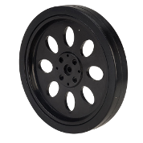   | Servo ratas                  | 2tk  |   2.19 EUR |  4.38 EUR | +0.94 EUR |
| 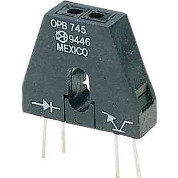 | Optek OPB745 jooneanduriks   | 3tk  |   3.00 EUR |  9.00 EUR | +9.00 EUR |

Lingid hankimiseks:

- http://www.aliexpress.com/item/Smart-car-tires-steering-wheel-tire-tire-rubber-tire-tracking-DIY-model-toy-car-accessories-aperture/2055170090.html
- http://ee.farnell.com/optek-technology/opb745/photo-interrupter-reflective-3/dp/1497910

##Emaplaat

Sumorobotil kasutame ajuna CHIP nimelist arvutit mille hinnaks on umbkaudu 8€. CHIP emaplaadil on realiseeritud SoC (System on Chip) koos WiFi toega.

CHIP-il on päised LCD paneeliga ning CSI kaamera liidestamiseks. Kuna Allwinneri kiibistik võimaldab neid jalgu programmeerida üldotstarbeliste sisend/väljundviikudena ja roboti puhul LCD paneelile rakendust pole, saab samu väljaviike kasutada servomootorite juhtumiseks või sensoritest sisendi lugemiseks.

##Tütarplaat

###Tütarplaadi skeem

Sumoroboti jaoks on vaja teha liidestused mootorite ning sensoritega. SumoCHIP skeemis on loodud liidestused CHIP-i päiste ning infrapuna kaugussensorite, joonejälgimissensorite, servomootorite ja diagnostiliste tuledega:

Skeemis on P abil märgistatud piikribad, D abil valgusdioodid, Q abil (foto)transistorid.

Roboti tööpõhimõte on üsna lihtne, robotil on kaheksa infrapunadioodi, mis lülitatakse võistlemise ajaks sisse, ning neist dioodidest tagasi peegelduvat valgust tuvastatakse kaheksa infrapuna fototransistoriga. Skeemis märgitud väljatransistor Q6 on kasutusel tütarplaadile joodetud D1, D6-D9 ning P13-P15 kaudu ühendatud infrapunadioodide sisse-välja lülitamiseks. Jõudeolekus on otstarbekas dioodid välja lülitada, muidu tarbivad nad asjata märgatava hulga voolu. Päise P7-8 jalgu tüüritakse vaikimisi läbi takistite 3.3V suunas, kuid tütarplaadile joodetud Q1-Q5 ning P10-P12 kaudu ühendatud fototransistorite avanedes peegeldunud või keskkkonna valguse tõttu tõmmatakse pinge 0V ligi. Tarkvaraliselt loogikaväärtusi kontrollides nendel jalgadel saab tuvastada, kas sensori ees on midagi (0V ehk *false*) või ei ole midagi (3.3V ehk *true*). Tütarplaadile joodetud sensorid on kasutusel vastase tuvastamiseks ning läbi P10-12 ja P13-15 kaudu on ühendatud joonejälgimissensorid.

###Trükkplaadi hankimine

Juhtmetega liidestuse tegemine on kohmakas ning on oht teha vigu, mistõttu võib kogu plaat maha põleda. Seetõttu on soovitatud hankida trükkplaat, mis ülalnimetatud skeemi realiseerib.

SumoCHIP trükkplaadi hankimiseks on laias laastus neli varianti:

* Osta IT Kolledži robootikaklubist
* Freesida CNC abil
* Söövitada koduste vahenditega
* Tellida DirtyPCB-st

Kicadi projekti leiab Git lähtekoodivaramust, sellest saab eksportida LinuxCNC jaoks sobivas formaadis failid. Freesimine käib kolmes etapis: esmalt freesitakse V-tüüpi otsikuga alumine pool (back.ngc); seejärel puuritakse augud (drill.ngc); jargnevalt pööratakse trükkplaat ümber, kinnitatakse külgmistesse aukudesse ning lõpuks freesitakse trükkplaadi ülemine pool (front.ngc). Näide CNC masinaga trükkplaadi freesimisest:

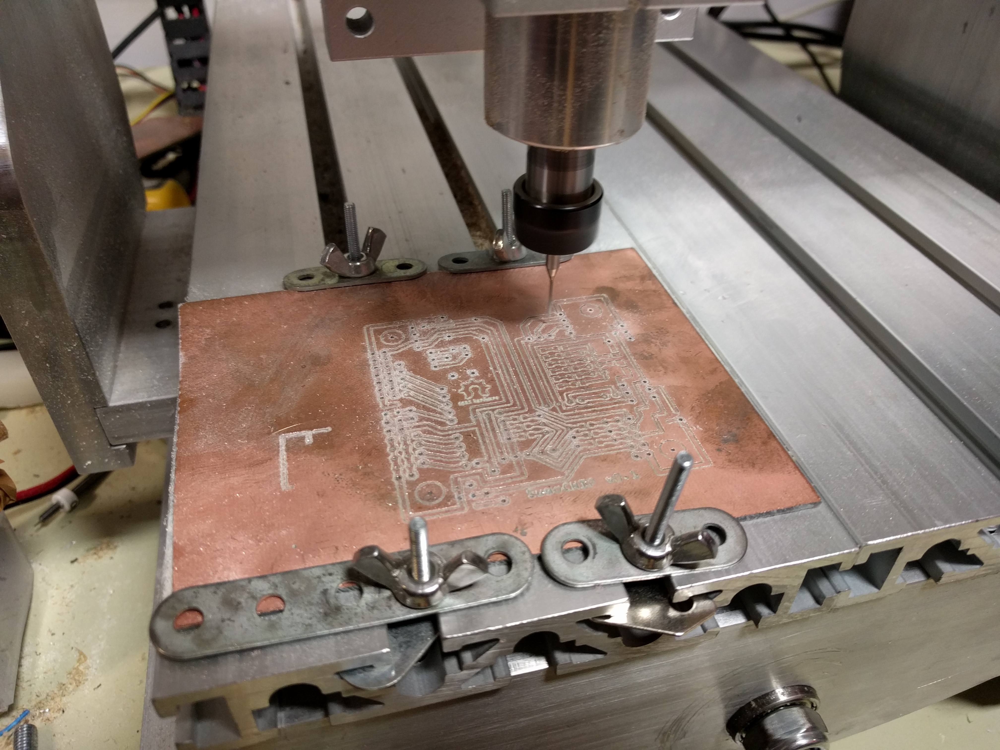

###Komponentide jootmine

Komponentide jootmisel on abiks järgnev joonis:

Jootmise järjekord:

0. Jooda takistid R1-R20
0. Jooda päised P1-P16
0. Jooda väljatransistor Q6
0. Jooda infrapuna valgusdioodid D1, D6-D8
0. Jooda infrapuna fototransistorid Q1-Q4
0. Jooda valgusdioodid D2-D5

###Plaadi testimine

Kontrolli testeriga, et omavahel lühises ei oleks:

* Maa ja 3.3V rajad
* Maa ja 5V rajad
* 3.3V ja 5V rajad

[Tagasi avalehele](index-et.md "Avalehele")
[Edasi kokkupanemine](kokkupanemine.md "Kokkupanemine")
