##Tarkvara
* [Tarkvara](#tarkvara)
    * [Tarkvara paigaldus](#tarkvara-paigaldus)
    * [Ohjurtarkvara paigaldus](#ohjurtarkvara-paigaldus)
    * [Jadaliidese avamine](#jadaliidese-avamine)
    * [Robotisse sisse logimine](#robotisse-sisse-logimine)
    * [Võrgu seadistamine](#võrgu-seadistamine)
    * [Operatsioonisüsteemi uuendamine](#operatsioonisüsteemi-uuendamine)
    * [Sõltuvuste paigaldamine](#sõltuvuste-paigaldamine)
    * [Sumoroboti tarkvara paigaldus](#sumoroboti-tarkvara-paigaldus)
* [Terminaliga ringi käimine](#robot-valmis)
    * [Enimkasutatavad käsud](#enimkasutatavad-käsud)
    * [Failide redigeerimine terminalis](#failide-redigeerimine-terminalis)
    


Sumoroboti baastarkvara on kirjutatud Python programmeerimiskeeles kasutades Flask veebirakenduste raamistikku. Baastarkvara lähtekood on kättesaadav GitHubist aadressil https://github.com/laurivosandi/sumochip ning parandused ning täiendused on teretulnud.


###Tarkvara paigaldus

Sumorobotit saab veebi kaudu programmeerida aga selleks et seda üldse teha on vaja robotisse esmalt paigaldada veebirakendus. Piisab sellest, et järgnevad sammud üks kord läbi teha roboti peal.

Kuna CHIP-il pole videoväljundeid on kuvari ühendamine problemaatiline. Eelistatud on hoopiski üle USB kaabli jadaliidese kasutamine selleks, et robotile teha esmane seadistus. Windows puhul on vaja paigaldada ohjurtarkvara, et üldse USB kaablit kasutada saaks. Mac OS X ning Linux puhul seda teha vaja pole.

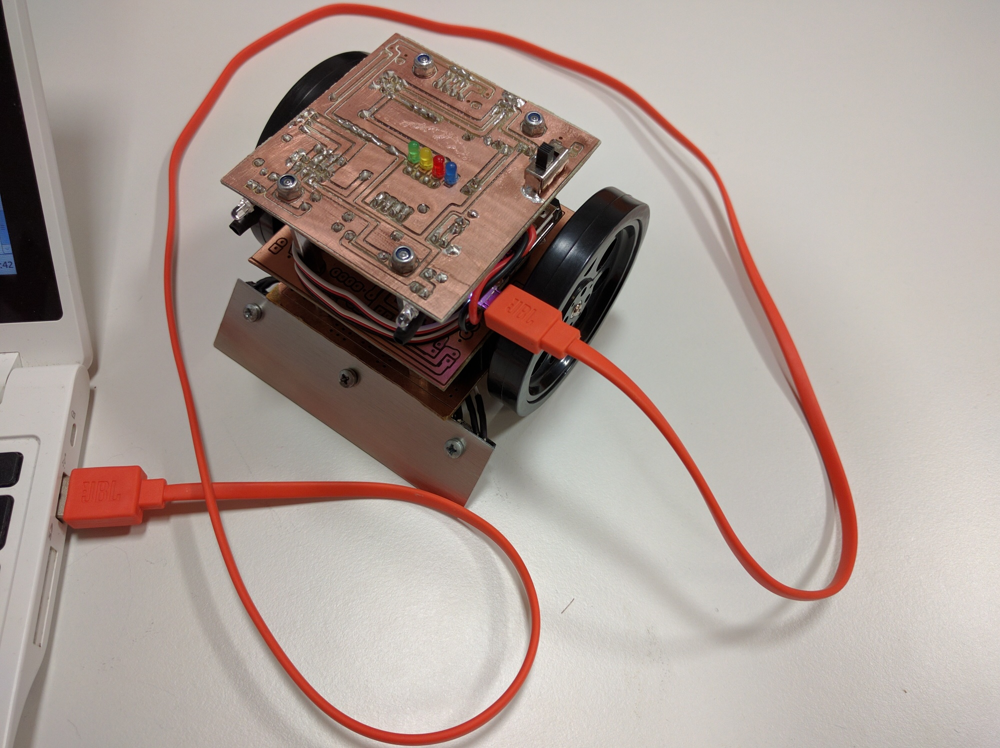

###Ohjurtarkvara paigaldus

Ubuntu ning Mac OS X all ohjurtarkvara paigaldada pole vaja, Windowsi puhul on asi mõnevõrra keerukam. Ava *Device Manager*:

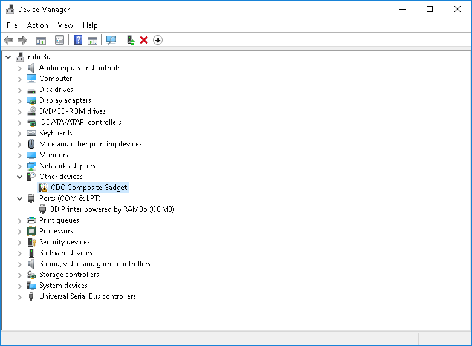

Leia nimistust kollase kolmnurgaga *CDC Composite Gadget* ning tee parem klõps sellel ning vali menüüst *Update Driver Software...*:

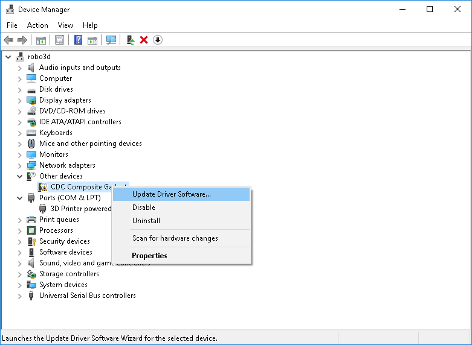

Järgnevalt vali *Browse my computer for driver software*:

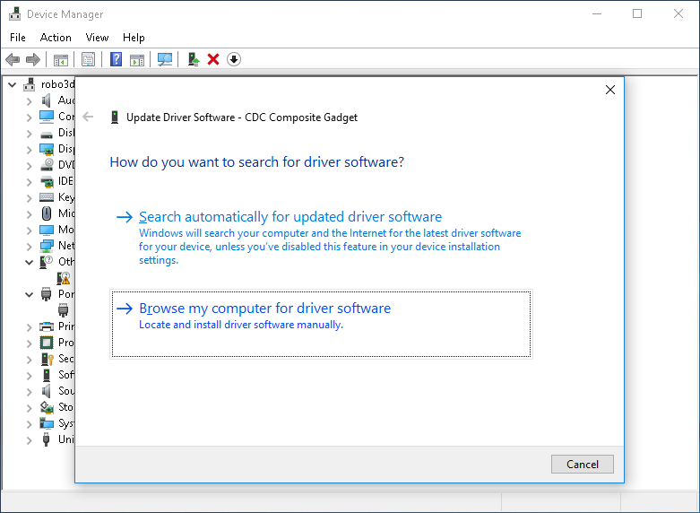

Seejärel vali *Let me pick from a list of device drivers on my computer*:

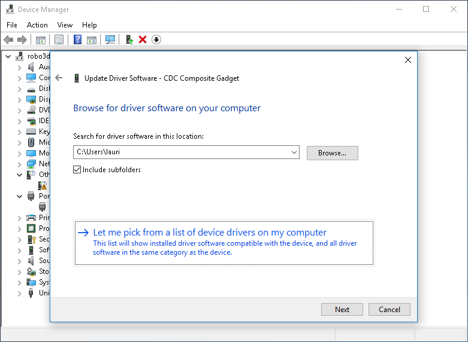

Jäta valituks *Show All Devices* ning klõpsa *Next* nupul:

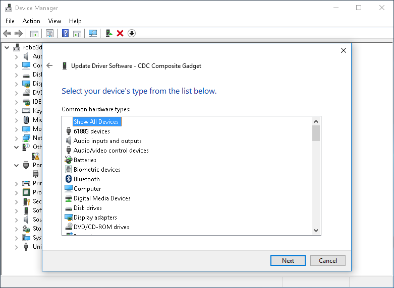

Keri vasakpoolses nimekirjas allapoole ning vali *Microsoft* seejärel keri parempoolses nimekirjas alla ning vali *USB Serial Device*:

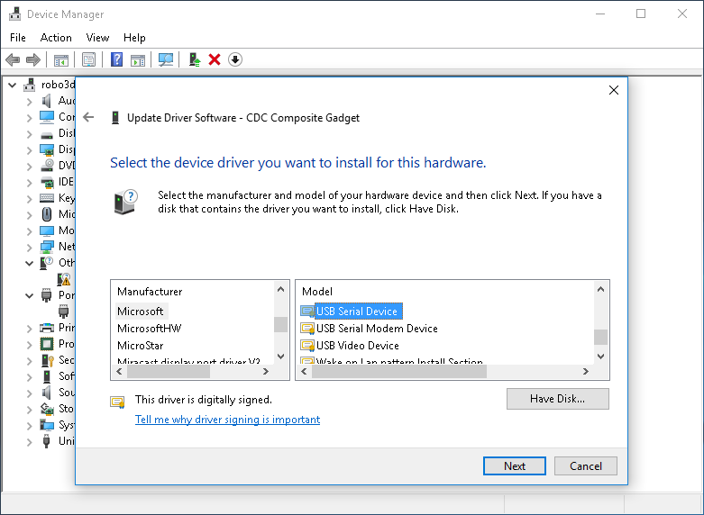

Hoiatusaknas klõpsa *Yes* nupul:

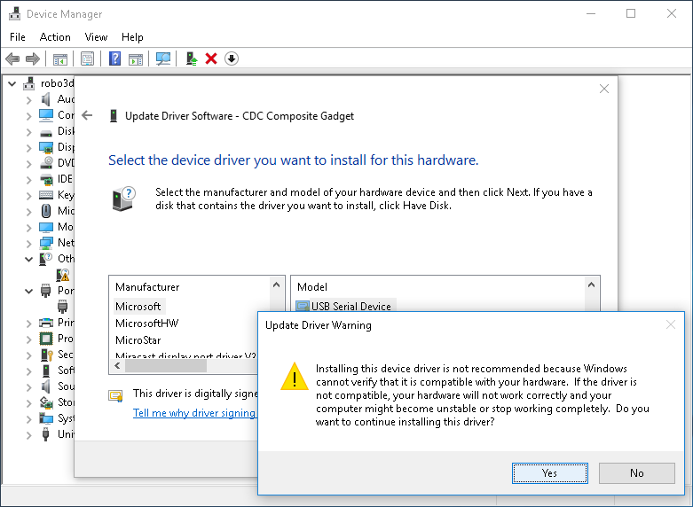

Ohjurtarkvara peaks olema seejärel edukalt paigaldatud:

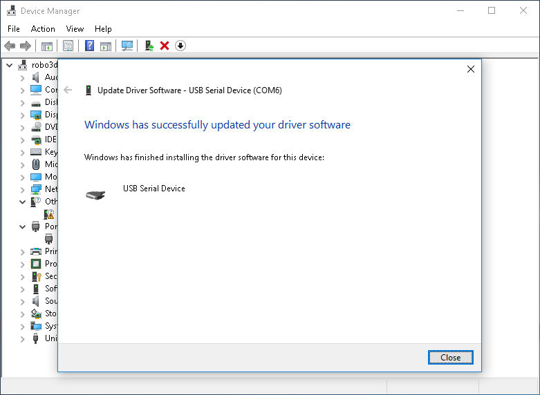

Seadmete nimekirja peaks tekkima uus *USB Serial Device* seade. Jäta selle jadaliidese number meelde, järgneval kuvatõmmisel on ta nimeks COM6:

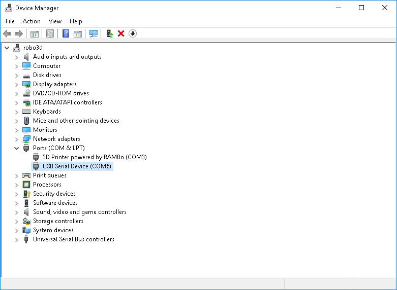


###Jadaliidese avamine

Jadaliidese kasutamiseks võivad Windowsi kasutajad pruukida [PuTTY](http://www.chiark.greenend.org.uk/~sgtatham/putty/download.html) nimelist programmi. Ubuntu ning teiste UNIX-ilaadsete operatsioonisüsteemide all võib kasutada `screen`, `picocom` vms programme. Jadaliides võimaldab ligipääsu CHIP-i sees käiva tarkvara käsureale nii nagu paljude teiste nutiseadmete puhul. CHIP kasutab operatsioonisüsteemina Debiani ning paljud Ubuntust tuttavad käsud toimivad seal täpselt samamoodi.


###Robotisse sisse logimine

Kasutajanimi on *root* ning parool on *chip*.


###Võrgu seadistamine

Esmalt ühenda CHIP WiFi kaudu Internetti, selleks saad kasutada NetworkManageri pseudograafilist kasutajaliidest:

```bash
nmtui
```

Interneti ühenduse olemasolus saad veenduda näiteks `ping` abil, vajuta Ctrl-C et katkestada:

```bash
ping neti.ee
```

Kuna CHIP-il pole akut ega kella mis aja üle arvestust peaks püüab CHIP peale võrguühenduse loomist kellaaega küsida Internetist aga mõnikord võib see ebaõnnestuda. Kellaaja kontrollimiseks saab kasutada järgnevat käsku, turvalised ühendused Internetti (nt GitHub) kipuvad ebaõnnestuma kui kell on vale:

```bash
date
```


###Operatsioonisüsteemi uuendamine

Kui võrguühendus on olemas võime teha CHIP-i operatsioonisüsteemile tarkvarauuenduse:

```bash
apt update       # Uuenda pakettide nimekirju
apt full-upgrade   # Uuenda pakette
```


### Sõltuvuste paigaldamine

Paigalda sõltuvused ning Git versioonihaldustarkvara:

```bash
apt install python-pip python-dev git
```

###Sumoroboti tarkvara paigaldus

Seejärel võime paigaldada sumoroboti tarkvara:

```bash
pip install sumochip
```

Kui kõik on seni sujuvalt kulgenud võib välja uurida mis IP aadressil CHIP asub. Selleks saab kasutada käsku:

```bash
ifconfig
```

Proovi algatada SSH ühendus robotisse, Windowsis saab selleks kasutada PuTTY-t ning UNIX-iliste all:

```bash
ssh <ip-aadress>
```

###Sumoroboti tarkvara seadistamine

Paigalda konfiguratsioonifail mis ütleb mis jalgade külge servomootorid ja sensorid ühendatud on:

```bash
mkdir -p /etc/sumorobot/
curl https://raw.githubusercontent.com/artizirk/sumochip/master/sumochip/config/sumochip_v1.1.ini > /etc/sumorobot/sumorobot.ini
```


Käivita testprogramm, katkestamiseks vajuta jällegi Ctrl-C:

```bash
sumochip_test
```

Kontrolli, et jooneandurite LED-id toimivad. Selleks vaata jooneanduritesse mobiiltelefoni kaamera kaudu. Kaameras paistab infrapuna violetsena:

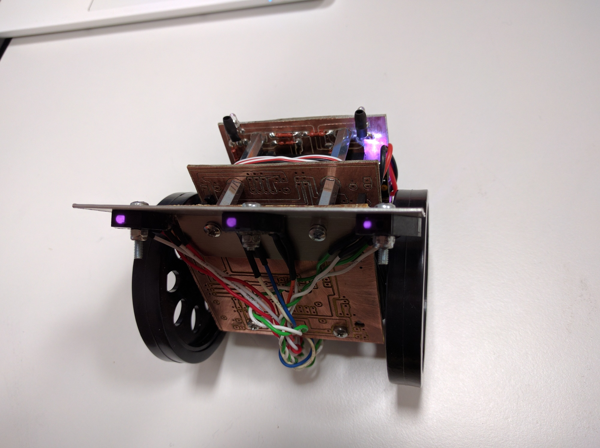

Soorita sama kontroll ka vastase tuvastamise sensoritel:

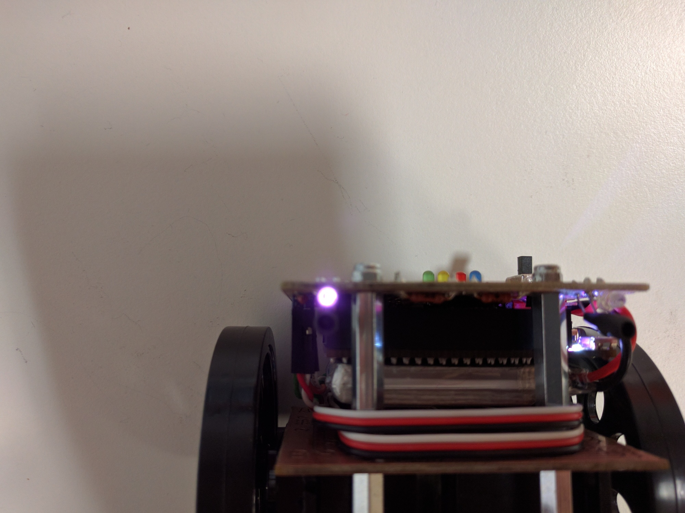


Proovi käivitada ka veebiliides:

```bash
sumochip_web
```


Kui on vaja robotit viisakalt kinni panna siis selle jaoks saab kasutada käsku:

```bash
shutdown -h now
```


##Terminaliga ringi käimine

###Enimkasutatavad käsud

CHIP-i peal kasutatavad käsud töötavad täpselt samamoodi Raspberry Pi ning Ubuntu peal:

* Praeguse kataloogi tuvastamine: `pwd`
* Failide ning kataloogide nimekirja kuvamine praeguses kataloogis: `ls -lah`
* Sisene kataloogi: `cd katalooginimi`
* Mine ülemisse kataloogi: `cd ..`
* Faili kustutamine: `rm failinimi`

###Failide redigeerimine terminalis

CHIP-il nagu paljudel teistel Linuxilistel on kohe kaasas tekstiredaktor `nano`, selleks et faili avada selle programmiga:

```bash
nano tee/failini.py
```
Kasuta klahvikombinatsiooni Ctrl-K et teksti paigutada lõikepuhvrisse ning Ctrl-U et neid uude valitud kohta kleepida. Ctrl-X abil saab salvestada faili ning programmist väljuda.

Pisut mugavam tekstiredaktor on Midnight Commander koosseisus, selle paigaldamiseks:

```Bash
apt install mc
```

Failide avamine käib samamoodi:

```bash
mcedit tee/failini.py
```
Menüüdes navigeerimine käib analoogselt graafiliste rakendustega, Alt-F avab peamenüü. Kiirklahvidest kõige olulisemad on F5 kopeerimiseks, F6 lõikamiseks ning F10 programmist väljumiseks.

[Avalehele](index-et.md "Avalehele")
